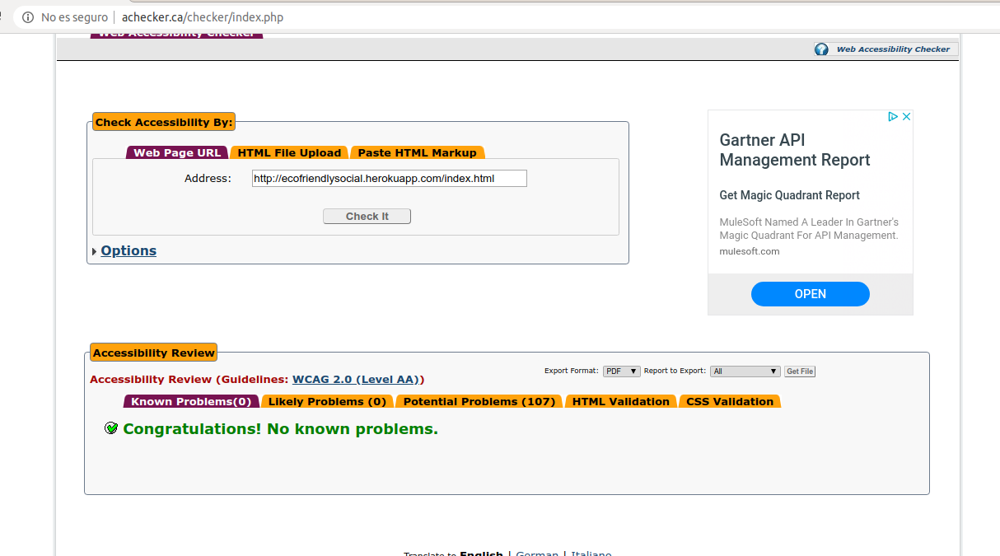

# Anexos

### **([R34](https://github.com/alfredobp/ecofriendly/issues/34)) Validación HTML5, CSS3 y accesibilidad**

---
### Validación de HTML y CSS

**HTML**

<!-- [Enlace a la validación HTML](https://validator.w3.org/nu/?doc=http%3A%2F%2Fecofriendly.herokuapp.com%2F) -->

**CSS**

<!-- [Enlace a la validación CSS](https://jigsaw.w3.org/css-validator/validator?uri=http%3A%2F%2F=all&warning=1&vextwarning=&lang=es) -->

---

### Validación de accesibilidad

[Enlace a la validación WCAG](https://achecker.ca/checker/)

La página index cumple el nivel AA de accesibilidad, se detectan varios errores,  debidos a la utilización de pluguins y que no se detectan el código en el IDE.

---