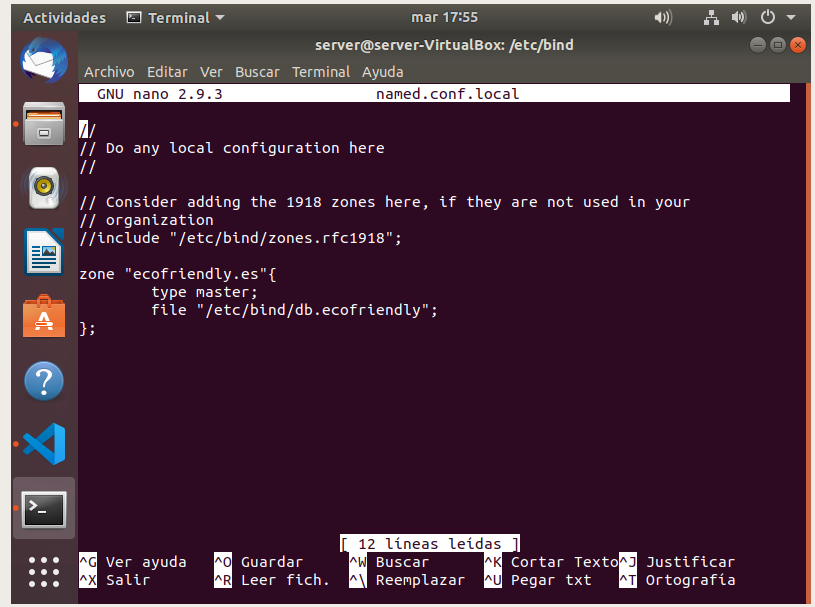
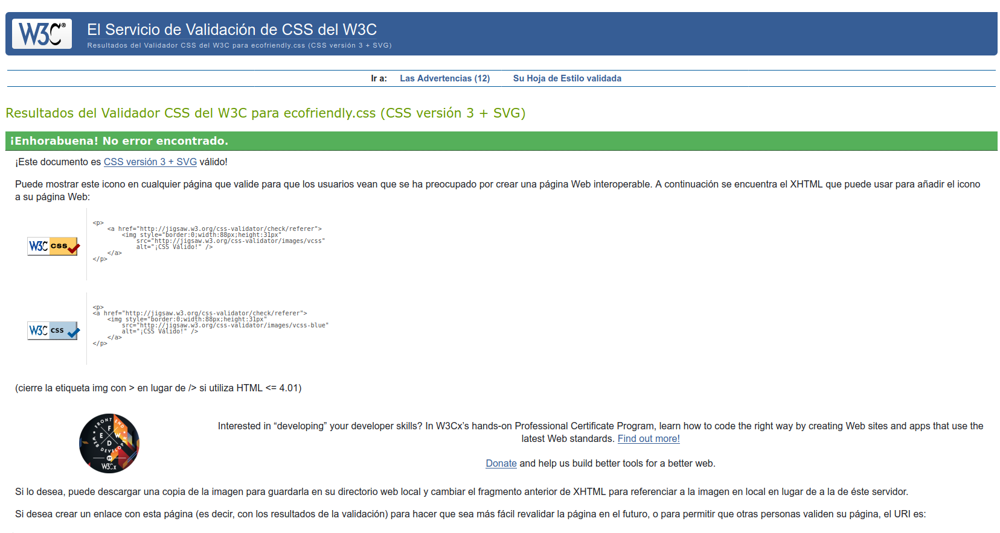
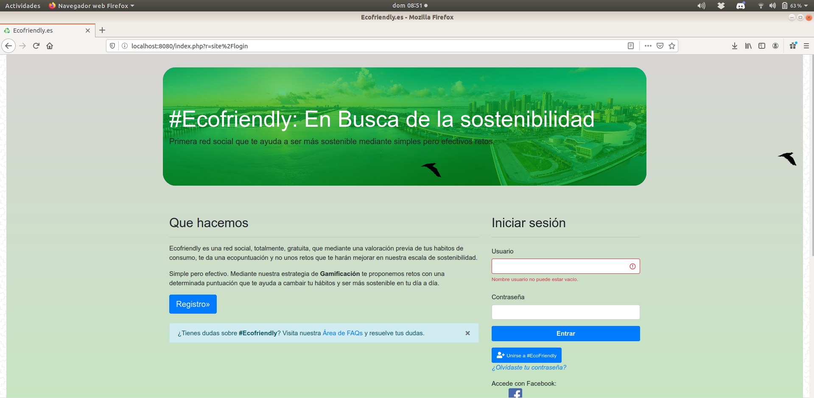

# Anexos

## **([R38](https://github.com/alfredobp/ecofriendly/issues/38)) Despliegue en un servidor local**

  

  
  

  

  

  

  

  

  

  

  

  

  

    

  
---

### **([R34](https://github.com/alfredobp/ecofriendly/issues/34)) Validación HTML5, CSS3 y accesibilidad**

---
### Validación de HTML y CSS

**HTML**

[Enlace a la validación HTML](https://validator.w3.org/nu/?showsource=yes&showoutline=yes&doc=http%3A%2F%2Fecofriendlysocial.herokuapp.com)

**CSS**

<!-- [Enlace a la validación CSS](https://jigsaw.w3.org/css-validator/validator?uri=http%3A%2F%2F=all&warning=1&vextwarning=&lang=es) -->

---

### Validación de accesibilidad

[Enlace a la validación WCAG](https://achecker.ca/checker/)

La página index cumple el nivel AA de accesibilidad, se detectan varios errores,  debidos a la utilización de plugins y que no se detectan el código en el IDE, ni puedo modificar.

---

### Prueba del seis

 1. ¿Qué sitio es éste?
- La aplicación tiene en todo momento elementos indicativos de que sitio es, contemplando el nombre de la aplicación. En la parte superior aparece el menú de navegación apareciendo siempre el titulo de la aplicación y las diferentes secciones de la página. Abajo en el pié de página, esta también el nombre de la web, la dirección de contactoga , por lo que siempre se encuenta el sitio identificado.

 2. ¿En qué página estoy?
- Todas las páginas del sitio están identificadas por las migas de pan, excepto en la página inicial y en las permitidas por el  no logueo.

 3. ¿Cuales son las principales secciones del sitio?
- Las principales secciones del sitio son *Inicio*, *Mensajes*, *Notificaciones*, *Área de usuario* y *Buscar* . Esta zonas solo son visibles si estamos logueados en la aplicación.

 4. ¿Qué opciones tengo en este nivel?
- Dentro de las diferentes opciones, aparecen tabs, con las diferentes secciones del lugar, indicando de forma clara las diferentes opciones del lugar.

 5. ¿Dónde estoy en el esquema de las cosas?
- En todas las páginas existe en la zona superior un indicador de bloque con las migas de pan.

 6. ¿Cómo busco algo?
- La barra superior tiene siempre un buscador activo así como un área de FAQs sobre instrucciones de utilización del sitio..

---
### **([R36](https://github.com/alfredobp/ecofriendly/issues/36)) Varios navegadores**
#### **Google Chrome**

---
#### **Mozilla Firefox**

---

#### **Opera**

---
### **([R26](https://github.com/alfredobp/ecofriendly/issues/26)) Validación HTML5, CSS3 y accesibilidad**

---
### **([R25](https://github.com/alfredobp/ecofriendly/issues/25)) Codeception**

---